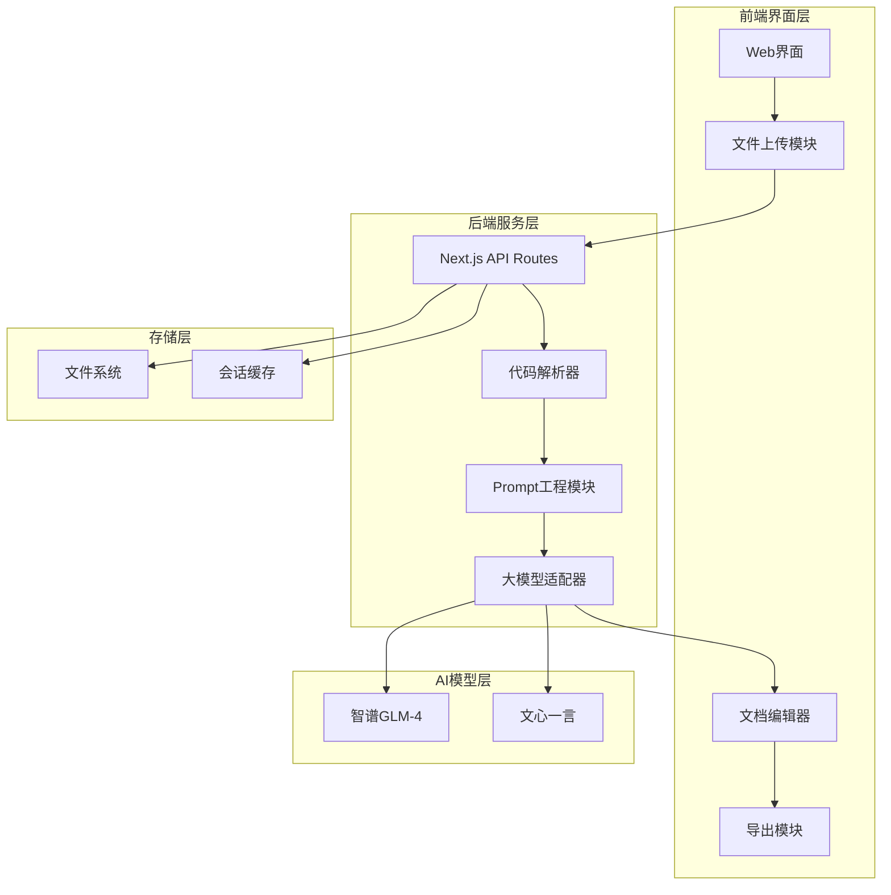
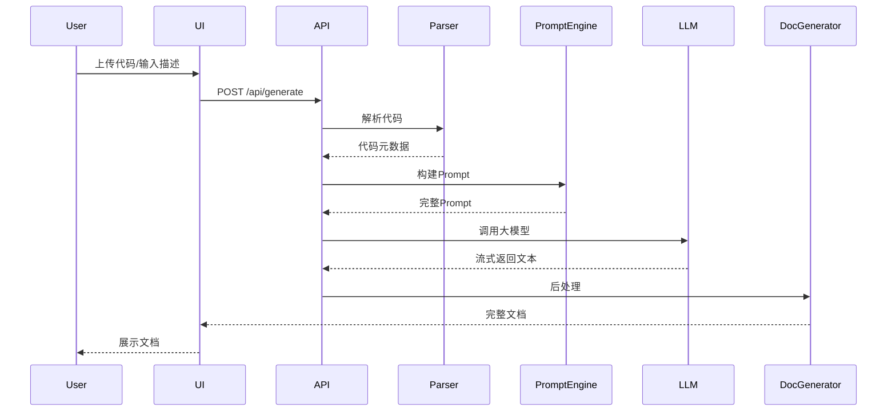

# 基于AI的软件工程文档自动生成系统设计方案

## 一、系统架构设计

### 1.1 技术栈选型

**前端技术**
- Next.js 14+ (App Router)
- React 18
- TypeScript
- Tailwind CSS
- shadcn/ui 组件库

**后端技术**
- Next.js API Routes
- 大模型集成：智谱GLM-4 / 文心一言 API

**代码分析**
- @babel/parser (JavaScript/TypeScript AST解析)
- tree-sitter (多语言代码解析)
- 正则表达式提取关键信息

### 1.2 系统架构图



## 二、核心功能模块设计

### 2.1 代码解析引擎 (Code Parser)

**功能职责**
- 解析上传的源代码文件（支持 .js, .ts, .py, .java 等）
- 提取代码结构信息：类、函数、接口、注释
- 分析函数签名、参数类型、返回值
- 提取现有注释和文档字符串

**实现方案**
- 使用 `@babel/parser` 解析 JavaScript/TypeScript
- 使用 `tree-sitter` 解析 Python/Java
- 输出结构化的代码元数据 JSON

**关键文件**
- `src/lib/code-parser/index.ts` - 解析器入口
- `src/lib/code-parser/js-parser.ts` - JS/TS解析
- `src/lib/code-parser/python-parser.ts` - Python解析

### 2.2 Prompt工程模块 (Prompt Engine)

**功能职责**
- 根据文档类型构建定制化的Prompt模板
- 将代码元数据注入到Prompt中
- 优化Prompt以提高生成质量

**文档类型与Prompt策略**

| 文档类型 | Prompt策略 | 输出格式 |
|---------|-----------|---------|
| 需求文档 | 从代码推导业务需求，生成用户故事 | Markdown |
| 设计文档 | 分析架构模式，生成系统设计说明 | Markdown + Mermaid图 |
| API文档 | 提取接口定义，生成OpenAPI规范 | Markdown / JSON |
| 测试文档 | 分析函数逻辑，生成测试用例 | Markdown / 代码 |

**关键文件**
- `src/lib/prompts/templates.ts` - Prompt模板
- `src/lib/prompts/builder.ts` - Prompt构建器

### 2.3 大模型适配器 (LLM Adapter)

**功能职责**
- 统一封装不同大模型API接口
- 处理API调用、错误重试、流式返回
- 支持模型切换

**实现方案**
```typescript
interface LLMProvider {
  name: string;
  apiKey: string;
  generateDoc(prompt: string, options: GenerateOptions): Promise<string>;
}

class ZhipuGLMProvider implements LLMProvider {
  // 智谱GLM-4 API实现
}

class ErnieProvider implements LLMProvider {
  // 文心一言 API实现
}
```

**关键文件**
- `src/lib/llm/adapter.ts` - LLM适配器基类
- `src/lib/llm/zhipu-glm.ts` - 智谱GLM实现
- `src/lib/llm/ernie.ts` - 文心一言实现

### 2.4 文档生成器 (Document Generator)

**功能职责**
- 协调各模块完成文档生成流程
- 支持流式生成（实时显示生成进度）
- 后处理优化（格式化、补充目录等）

**生成流程**


### 2.5 Web用户界面

**页面结构**
- `/` - 首页（选择文档类型）
- `/generate/code` - 代码上传生成页面
- `/generate/text` - 文本描述生成页面
- `/result/[id]` - 文档结果展示与编辑
- `/settings` - API配置页面

**关键组件**
- `CodeUploader` - 代码文件上传组件
- `MarkdownEditor` - 文档编辑器（支持实时预览）
- `DocumentViewer` - 文档展示组件
- `ExportButton` - 导出功能（PDF/Markdown/DOCX）

## 三、API路由设计

```
POST /api/parse-code
  - 解析上传的代码文件
  - 返回代码元数据

POST /api/generate-doc
  - 生成文档
  - 支持流式返回 (Server-Sent Events)
  
GET /api/doc/[id]
  - 获取已生成的文档

POST /api/export
  - 导出文档（PDF/DOCX）
  
POST /api/llm/test-connection
  - 测试大模型API连接
```

**关键文件**
- `src/app/api/parse-code/route.ts`
- `src/app/api/generate-doc/route.ts`
- `src/app/api/doc/[id]/route.ts`
- `src/app/api/export/route.ts`

## 四、实现步骤与开发顺序

### 阶段一：项目初始化与基础框架 (1-2周)
1. 创建 Next.js 项目，配置 TypeScript + Tailwind
2. 设计UI框架和路由结构
3. 搭建基础组件库（文件上传、编辑器）

### 阶段二：代码解析引擎开发 (2-3周)
1. 实现 JavaScript/TypeScript 解析器
2. 实现 Python 解析器（可选其他语言）
3. 测试解析准确性，提取关键信息

### 阶段三：大模型集成 (1-2周)
1. 注册智谱GLM / 文心一言 API
2. 实现 LLM 适配器接口
3. 测试API调用和流式返回

### 阶段四：Prompt工程与文档生成 (3-4周)
1. 设计各类文档的 Prompt 模板
2. 实现 Prompt 构建逻辑
3. 开发文档生成 API
4. 优化生成质量（多次迭代Prompt）

### 阶段五：前端界面完善 (2周)
1. 完成所有页面开发
2. 实现实时生成预览
3. 添加导出功能

### 阶段六：测试与优化 (2周)
1. 功能测试（各类代码和文档类型）
2. 性能优化（并发、缓存）
3. 用户体验优化

### 阶段七：论文撰写与答辩准备 (2-3周)
1. 整理技术文档
2. 准备测试数据和对比实验
3. 撰写毕业论文
4. 制作答辩PPT

## 五、技术难点与解决方案

### 5.1 代码解析准确性
**挑战**：不同编程语言语法差异大
**方案**：
- 使用成熟的解析库（babel, tree-sitter）
- 限定支持的语言范围（先做好2-3种）
- 提供手动补充接口

### 5.2 Prompt工程质量
**挑战**：生成文档质量不稳定
**方案**：
- 使用少样本学习（Few-shot Learning）
- 提供示例文档作为参考
- 迭代优化Prompt模板
- 添加后处理规则

### 5.3 大模型API成本
**挑战**：频繁调用API成本高
**方案**：
- 实现结果缓存机制
- 提供本地示例模式（不调用API）
- 使用较便宜的模型（GLM-3）

### 5.4 长文档生成
**挑战**：大模型token限制
**方案**：
- 分段生成，最后合并
- 使用文档大纲先行策略
- 支持增量生成

## 六、论文研究点与创新点

### 6.1 研究点
1. 基于代码AST的智能信息提取方法
2. 面向不同文档类型的Prompt工程优化
3. 大模型在软件工程文档生成中的应用效果评估

### 6.2 创新点
1. 多类型文档统一生成平台
2. 代码+文本双输入融合机制
3. 可定制的文档模板系统

### 6.3 实验对比
- 对比手工编写 vs AI生成的文档质量
- 对比不同大模型的生成效果
- 评估指标：准确性、完整性、可读性、生成时间

## 七、项目目录结构

```
ai-doc-generator/
├── src/
│   ├── app/
│   │   ├── api/
│   │   │   ├── parse-code/
│   │   │   │   └── route.ts
│   │   │   ├── generate-doc/
│   │   │   │   └── route.ts
│   │   │   ├── doc/[id]/
│   │   │   │   └── route.ts
│   │   │   └── export/
│   │   │       └── route.ts
│   │   ├── generate/
│   │   │   ├── code/
│   │   │   │   └── page.tsx
│   │   │   └── text/
│   │   │       └── page.tsx
│   │   ├── result/[id]/
│   │   │   └── page.tsx
│   │   ├── settings/
│   │   │   └── page.tsx
│   │   ├── layout.tsx
│   │   └── page.tsx
│   ├── lib/
│   │   ├── code-parser/
│   │   │   ├── index.ts
│   │   │   ├── js-parser.ts
│   │   │   └── python-parser.ts
│   │   ├── llm/
│   │   │   ├── adapter.ts
│   │   │   ├── zhipu-glm.ts
│   │   │   └── ernie.ts
│   │   ├── prompts/
│   │   │   ├── templates.ts
│   │   │   └── builder.ts
│   │   └── doc-generator/
│   │       └── index.ts
│   └── components/
│       ├── ui/
│       ├── CodeUploader.tsx
│       ├── MarkdownEditor.tsx
│       ├── DocumentViewer.tsx
│       └── ExportButton.tsx
├── public/
├── package.json
├── tailwind.config.ts
├── tsconfig.json
└── README.md
```

## 八、开发环境要求

- Node.js 18+
- npm 或 pnpm
- 大模型API密钥（智谱GLM或文心一言）
- VS Code + 相关插件

## 九、预期成果

1. 完整的Web应用系统
2. 支持至少2种编程语言的代码解析
3. 生成4种类型的工程文档
4. 系统演示视频
5. 完整的毕业论文（包含技术实现和实验对比）
6. 答辩PPT和演示材料

## 十、后续扩展方向

如时间充裕，可考虑扩展以下功能：

1. **UML图自动生成**：基于代码结构生成类图、时序图等
2. **README文档生成**：为开源项目自动生成README
3. **多语言支持**：扩展支持更多编程语言
4. **文档版本管理**：支持文档历史记录和对比

